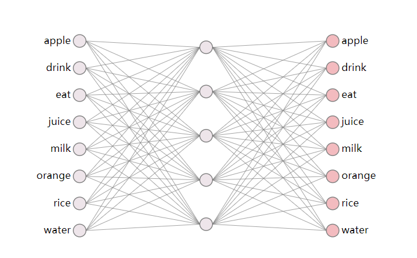
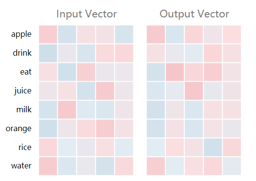
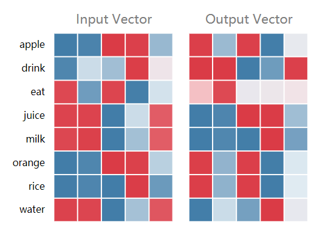
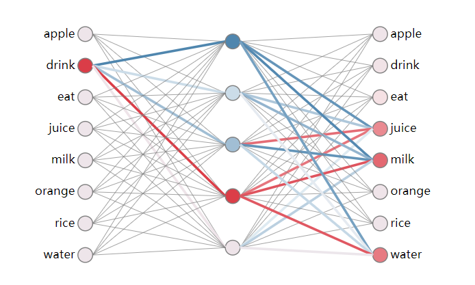

>  终于是花了三四天时间断断续续看完了cs224n lecture2，难度真的是指数型上升。


## 基本原理

### 词嵌入

- 什么是词嵌入？

  自然语言不像图像信息一样，自然语言的基本单位是文字，在英文中是word，中文中是字，他们都是有具体意义的抽象表示，而所谓图像处理，处理的本身就是图像信号，图像本身在采集或者创建好就是以数字形式存储在计算中。但是，重点来了，要使用统计的方法处理自然语言，就必须以一定的形式量化编码词，说简单一点，就是把符号形式的文字转化成数值，或者说嵌入到一个数学空间里，建立一个从文字到数学空间的映射。也就是所谓的词嵌入，而这里要将到的 [**word2vec**](https://en.wikipedia.org/wiki/Word2vec)便是常用的词嵌入的一种。**也就是说，词嵌入就是把词进行了数值化的表示。**

- 如何进行词嵌入？

  **word2vec** 是一种典型的词嵌入方法，使用一个全连接网络（输入层，隐含层，输出层）得到一个训练好的可以表征词向量的模型。

### wrod2vec的一些具体含义

- 比较直观的理解

  比较通俗的解释方法是，我们把一个词转化成所谓向量，也就是把这个词进行了量化表示，一个比较直观的例子，颜色。我们都知道，颜色在计算机中通常使用rgb，也就是红绿蓝三原色进行编码，很自然的可以通过一个三维向量，比如蓝色（0，0，255），这就是一个经过编码的空间向量，但如果我们不知道所谓的蓝色的向量化表示呢？这就是word2vec的意义所在，将蓝色这个直观意义上（假设）的**词语**(word)，映射为一个三维向量空间的向量（vector），也就是我们通常所称的rgb色彩空间。
  
  也就是：蓝色 -> （0，0，255）
  
  ​			     红色 ->   (255，0，0）
  
    			   绿色 -> （0，255，0）
  
  假设上边三个向量是我们训练出来的，而不是一种基于确定标准的量化，那么有意思的事情来了。
  
  我们知道，蓝色 + 绿色 = 青色，那么，如果我们拿 青色 这个词语放到神经网络里面去训练，得出的对应青色的向量，应该是大致就是（0，255，255），这就意味着，我们通过神经网络，找到了所谓的颜色之间的量化关系（大致上）也就是完成了所谓的词嵌入。
  
  当然，事实上，颜色并不是这么来的，图像信息作为一种天然可以被计算机量化的信息（曝光），原则上来说根本不需要这么个对颜色词语的词嵌入，这里只是为了举例。
  
  类似的，当我们拥有下面的词向量时：
  
  "Beijing"、"Tokyo"、"China"、"Japan"。
  
  如果训练的足够合理的话，我们应该能大致得到如下的关系
  $$
  \vec{Beijing}-\vec{China}+\vec{Japan} = \vec{Tokyo}
  $$
  所以，词向量中蕴含是词语之间真实关系的表述，也就是说，当北京有首都的属性和中国的属性，当二者相减时，我们就可以神奇的得到了一个可以表征首都属性的向量，很明显，当加上日本时，就出现了Tokyo。
  
  这就是word2vec的强大之处，将客观的词语进行向量化，从而使得原本单一的词语字符串可以进行数学运算，也就是实现了词嵌入。
  
- 一些需要注意的问题

  我们通过神经网络训练出来的词向量，理论上来说，我们并不容易知道每个维度其对应的确切意义所在。Manning在第一节课上也讲了这一点，这也就是所谓的黑箱（Black Box），黑箱这个东西的问题就在于，如果我们对黑箱的输入得到了正确的输出，那很好；但如果我们得到了错误的输出，那对于一般系统来说，可以通过调整参数来对系统进行修正，但调整参数来修正黑箱的性能似乎并不容易。典型的黑箱系统就是神经网络。如果我们仅仅只是要求了大量数据样本下的整体准确率，那很好，一个优秀的神经网络能够很高的准确率与性能，而且设计起来的成本也较一般传统方法大大降低。但是如果除了错就有可能造成不可挽回的后果，那么就必须谨慎使用这个东西了。所以，神经网络的可解释性也是一个非常重要的话题。这个东西，毕竟是一个基于统计学习训练出来的模型。（个人看法）

## 网络原理

### 神经网络

- 基本结构

  这部分确实看着很复杂，下面用例子简单说明

  我们假设要训练一个十个词语的 word2vec 

  {'apple','drink','eat','juice','milk','orange','rice','water'}

  我们基本的网络结构如下：

  

  如图所示，该网络是一个由10个输入节点的输入层，5个隐含节点的隐含层，10个输出节点的输出层的全连接网络。

- 参数推导(翻译自 Xin Rong的论文 arXiv:1411.2738v4 [cs.CL] 5 Jun 2016)

  我们以连续单上下文词预测单目标词的 CBOW（Continuous Bag-of-Word Model 连续词袋模型）进行参数的推导演示。

  在输入层和输出层之前的权重矩阵可以用一个 $V\times X$的矩阵来$W$来表示，$W$的每行，都是一个$N$维的向量记作$v_{\omega}$，对于$W$的第$i$行，对于给定上下文，假设$x_k= x_{k'}$，对于每个$k'\neq k$，我们有
  $$
  h=w^Tx=W^T_{k,.}:=v^T_{w_I} \tag1
  $$
  即本质上就是$W$对于$h$的第$k$行的复制，$V_{w_{I}}$是输入词的$w_I$的向量表示。这意味着隐含层神经元的激活函数是简单的线性函数。
  
  如图：
  
  
  
  从隐含层到输出层存在另一个大小为$N\times V$权重矩阵 $W'={w'_{ij}}$，使用这个矩阵，我们可以计算出每个词汇在整个词汇表中的分数值（score）,
  $$
  u_j=v_{w_j}^Th\tag2
  $$
  其中 $v'_{w_j}$是矩阵$W'$的第*j*列。然后，我们可以使用soft-max，一个log-linear分类器模型,来获得随后词汇的分布结果，它是一个多项式形式的分布。
  $$
  p(w_j|w_I)=y_j=\frac{exp(u_j)}{\sum_{j'=1}^{V}{u_j'}}\tag3
  $$
  
  
  其中$y_j$是输出层第*j*个神经元的输出，(1)式，(2)式代入(3)中，我们就可以得到如下式子：
  $$
  p(w_j|w_I)=\frac{v'^T_{wj}v_{wI}}{\sum_{j'=1}^{V}exp(v'^{T}_{wj'}v_{wI})}
  $$
  
    注意：$v_w$和$v'_w$是$w$的两种表示方式。$v_w$来自输入层到隐含层的权重矩阵**W**的行，而$v'_w$来自隐含层到输出层的权重矩阵**W**的列。在随后的分析中，我们把$v_w$称作词*w*的"输入矩阵"，$v'_w$称作词*w*的输出矩阵。
  
  随后，我们就可以使用梯度下降法进行参数更新和训练。
  
- 直观演示

  这里使用了 Xin Rong论文中给的 [wevi](https://ronxin.github.io/wevi/)进行直观演示（上文中的图也是）

  - 网络结构（如上图网络结构）

  - 训练数据(context|target)

    ```json
    eat|apple,eat|orange,eat|rice,drink|juice,drink|milk,drink|water,orange|juice,apple|juice,rice|milk,milk|drink,water|drink,juice|drink
    ```

  - 初始状态（如上图所示矩阵）

  - 当我们训练500次时，两权重矩阵的变化如下：

    

  注意观察，这里orange和juice的词汇向量很相似，也就说明了这两个自然词汇之间存在的关系，基于我们的常识，orange juice 是一种非常合适的组合。类似的，网络结构中可以看出：

  

  由上图也可以看出，drink和milk、juice、water同时出现的概率较大，这也符合自然经验。

  其他诸如隐含层节点的一些有意思的性质，可以自行前往常识。

---

参考资料：

 Xin Rong *word2vec Parameter Learning Explained*

https://zhuanlan.zhihu.com/p/26306795 

https://gist.github.com/aparrish/2f562e3737544cf29aaf1af30362f469 

https://www.youtube.com/watch?v=D-ekE-Wlcds&feature=youtu.be

**Rong Xin 于2017年驾驶飞机失事** ，感谢他对人类做出的科研贡献 R.I.P.