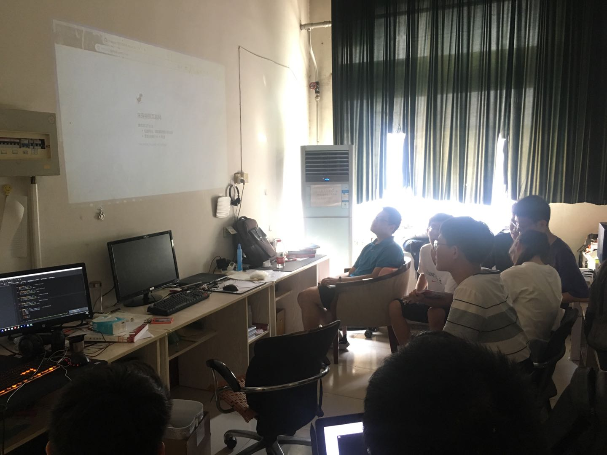
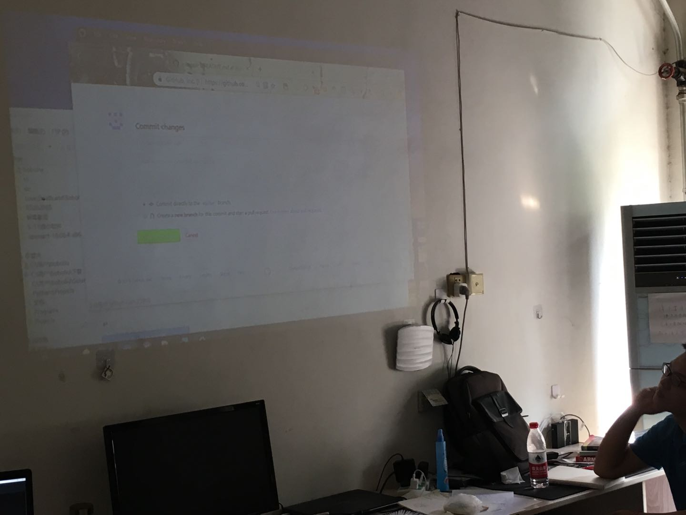
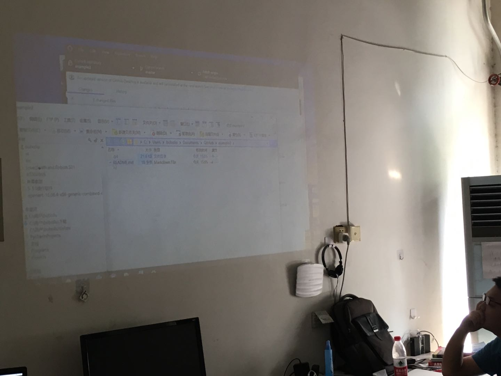
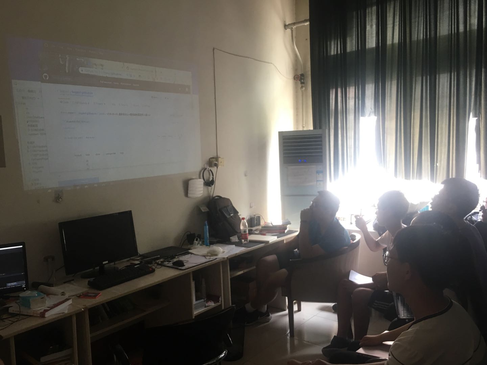

>  本周下午两点，在1#实验楼314举行了一次技术交流讲座，由[boboliu](https://boboliu.dev)同学主讲

## init

  初始化阶段似乎出了一些问题，311的投影仪并不能正常工作，最终选择了使用实验室最有钱的人的（boboliu）自带的投影仪。

## git的使用

虽然效果不是特别好，但是，能用。

大致讲解了如下几点：

- git 基本命令
- 本地仓库和远端不同步的解决方法
- 如何解决冲突

## github-pages的使用

  我们知道，写博客对于程序员来说是一个很好的习惯，github提供的pages静态站点托管服务可以很好的解决这一问题。

  boboliu同学大致演示了基本流程：

- fork其他人的jekyll repo
- 修改配置
- 使用markdown写博客

## conclusion

  第一次似乎不是那么成功，不过大家也学到了不少东西。

---

blogs
- [ModerRAS](https://miaostay.com/)
- [boboliu](https://boboliu.dev/) 
- [huangzhiwei](https://Hzw12138.github.io)
- [zuoyu](https://zy666.github.io)
- [zzy阴阳](http://39.106.35.123 )
- [songsiyan](https://little1234567.github.io)
- [liumengxian](https://AIWhiteTwo.github.io)
- [shiweichen](https://for-hub.github.io)
- [dingshuaikang](https://dingshuaikang.github.io)